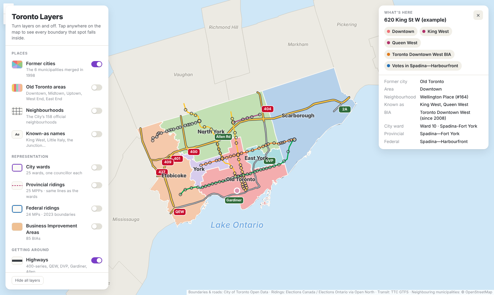
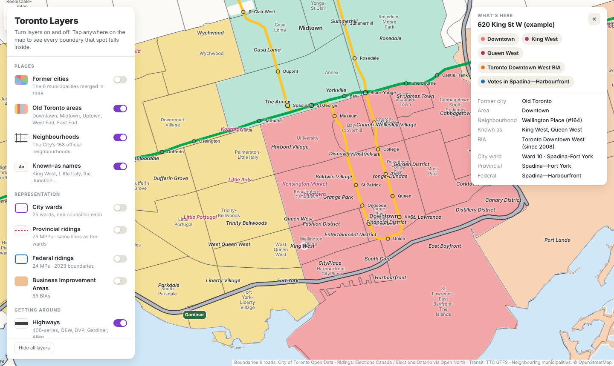

# City Layers

A city is divided up in a dozen ways at once: official neighbourhoods, council wards, state or provincial and federal electoral districts, business districts, the informal names locals actually use, and the transit lines that tie it together. Each of those lives in a different dataset on a different website. City Layers puts them on one interactive map you can switch on and off, then tap any spot (or search an address or place) to see every boundary it falls inside, what it's like to live there and who represents it. It's built for two kinds of people: a resident learning things they probably didn't know about their own city, and a newcomer getting their bearings.

The maps share one engine, with a folder of data and settings per city:

- **Toronto Layers:** https://maps.noumankhan.ca/toronto/
- **Chicago Layers** (work in progress): https://maps.noumankhan.ca/chicago/

## Toronto Layers

An interactive map of the City of Toronto where you turn civic and cultural boundaries on and off, then tap any spot to see every boundary it falls inside.



### Why

Toronto's geography is described in several overlapping ways at once. A single address can be in Old Toronto, "Downtown", the official neighbourhood of Wellington Place, what everyone calls King West, the Toronto Downtown West BIA, Ward 10, the provincial riding of Spadina—Fort York and the federal riding of Spadina—Harbourfront. Each of those lives in a different dataset on a different website. No public site I could find shows them together on one simple map.

### What it does

| Layer | Count | Notes |
|---|---|---|
| Former cities | 6 | The municipalities merged in 1998 |
| Old Toronto areas | 5 | Downtown, Midtown, Uptown,<br>West End, East End |
| Neighbourhoods | 158 | The City's official set (2022) |
| Known-as names | 85 | King West, Little Italy, the Junction… |
| Landmarks | 38 | Arenas, big parks, music venues,<br>civic buildings, campuses, airports |
| City wards | 25 | |
| Provincial ridings | 25 | Same lines as the wards |
| Federal ridings | 24 | 2023 Representation Order |
| Business Improvement Areas | 85 | |
| Neighbourhood lens | 158 | Housing cost, time to Union,<br>getting to work, renters and owners |
| Main streets | 321 streets | Major and minor arterials<br>(King, Queen, Eglinton…), named along the line |
| Highways | 10 in Toronto,<br>14 across the GTA | 400-series, QEW, 407 ETR,<br>DVP, Gardiner, Allen Rd |
| Subway & LRT | 5 lines | Lines 1, 2, 4, 5, 6 with station names |
| GO Transit trains | 7 lines<br>+ UP Express | ~70 stations, Metrolinx<br>line colours |

**Landmarks:** a short, curated list of the places Torontonians give directions by (Scotiabank Arena, High Park, Massey Hall, City Hall, U of T, Exhibition Place…), not an exhaustive points-of-interest database. Big, spread-out anchors appear city-wide; dense downtown venues appear as you zoom in, and overlapping labels are hidden automatically.

**Address search:** type a Toronto address (for example "789 Yonge St") and the map flies there, drops a pin and fills in the readout below. Addresses are matched with OpenStreetMap's Nominatim service, limited to the City of Toronto. Landmarks and place names also suggest themselves as you type, without any network call: landmarks with their old names and nicknames (SkyDome, Air Canada Centre, Ryerson, "the Ex"), plus every neighbourhood, known-as name, former city and surrounding municipality. Choosing a place like Deer Park or Mississauga frames it on the map and fills in the readout, switching to the regional view for places outside the city. On the Chicago map the same works for community areas, the sides and suburbs like Lombard.

**Around the city:** zoom out to see every municipality in the Greater Toronto Area (Halton, Peel, York and Durham regions) as plain grey shapes, for context.

**416 or 416 + 905:** a switch at the top of the layer panel picks the extent. *Toronto* (the default) greys out everything beyond the city limits and clips the GO lines at the boundary, leaving the TTC in full; *Greater Toronto Area* shows the highways and GO lines across the region.

**Starting view and Reset:** the map opens on Toronto with former cities, Old Toronto areas, neighbourhoods, known-as names, main streets, highways, GO and the subway switched on, and everything else off. *Reset*, at the bottom of the layer panel, returns to that view from wherever you've wandered (it also clears any neighbourhood filter); *Hide all* turns every layer off.

**Toronto in the GTA:** the highways continue past the city limits (OpenStreetMap data, joined to the City's centrelines at the boundary) and the GO Train lines run out to Barrie, Kitchener, Niagara Falls and Oshawa. Lines that share track near Union fan out as you zoom in. Tapping a spot outside Toronto names its municipality and region.

**Neighbourhood lens:** for someone new to Toronto, a quick sense of what each neighbourhood is like to live in. One lens at a time shades the 158 neighbourhoods in three plain tiers rather than precise figures:

- *Housing cost:* lower, middle or higher, from median home value and median rent, each ranked against the rest of the city and weighted by how many households own or rent.
- *Getting to work:* mostly transit, walk or bike; mixed; or mostly car, from the share of commuters who drive.
- *Renters and owners:* mostly owners, a mix, or mostly renters.
- *To Union:* the typical transit trip to Union Station on a weekday morning: under 30 minutes, 30–45, 45–60, or over an hour. Computed ahead of time from the TTC, GO and UP Express schedules with [r5py](https://r5py.readthedocs.io/), from points about 400 m apart across each neighbourhood (about 4,000 in all), leaving any time between 8 and 9 am. Walking to the stop and waiting count. Each neighbourhood shows the median of its points.

**Narrow it down:** under the lens legend, pick what you're looking for (say, middle housing cost and up to 45 minutes to Union) and the neighbourhoods that don't fit fade out. The ones that do are listed by name; tap one to fly there. It answers the question a newcomer actually asks: "where should I be looking?"

The What's here card adds a *Living here* section with the same tiers and the figures behind them (median home value and rent, time to Union, how people get to work, share of households renting). The point is the feel of a place relative to the rest of Toronto, not a price list.

**Light or dark:** the page follows your device's setting, or you can pick Light or Dark at the bottom of the layer panel.

**What's here:** click anywhere and a card sums up the spot in a few coloured pills, then breaks it down in sections you can open and close (the page remembers which you keep open):

- *Boundaries:* former city, area, neighbourhood, nearby known-as names, BIA, ward, provincial riding and federal riding.
- *Living here:* the neighbourhood lens tiers and the figures behind them.
- *Representatives:* the city councillor, MPP and MP for that spot, each name linking to their official page on toronto.ca, ola.org or ourcommons.ca, with party for the MPP and MP (Toronto councillors run without party labels).

The boundary lookup runs in the browser with point-in-polygon tests against every layer, whether or not the layer is switched on.

**Keeping representatives current:** a GitHub Action runs every Monday, reads the current members straight from the City, the Legislative Assembly and the House of Commons, and republishes the site only if something changed, so by-elections and the new council after an election show up within a week. Names come from the same pages they link to. Open North's representatives data was tried first and dropped: it still listed an MP six months after her by-election.



## Chicago Layers

**Live site (work in progress):** https://maps.noumankhan.ca/chicago/

The second city runs on the same engine with its own data and config (`cities/chicago/`). Chicago's layers line up with Toronto's:

| Layer | Count | Notes |
|---|---|---|
| The sides | 9 | Far North Side to Far Southeast Side,<br>the informal split Chicagoans use |
| Community areas | 77 | The City's official areas |
| Known-as names | 31 | Wicker Park, Gold Coast, Pilsen… |
| City wards | 50 | One alderperson each |
| Illinois House districts | 36 | Each pair makes a Senate district,<br>so one layer gives both |
| Congressional districts | 9 | Illinois seats in the U.S. House |
| Special Service Areas | 58 | Chicago's equivalent of BIAs |
| Expressways | 11 in Chicago | Kennedy, Dan Ryan, Eisenhower,<br>Stevenson, Lake Shore Drive |
| Metra | 11 lines | From four downtown terminals |
| The 'L' | 8 lines, 144 stations | CTA rapid transit |

The community area lens uses the American Community Survey (2020–2024 five-year estimates): Census tracts are grouped into community areas, and median home values and rents are read from the summed price brackets. Its tiers use the same cut-offs as Toronto's, so the two maps read alike. Representatives are the alderperson, state representative, state senator and member of Congress, refreshed weekly from the City's data portal, Open States and the Clerk of the House.

## How it's built

- **One engine, one folder per city.** The map page is a shared engine (`engine/`) that knows how to draw kinds of layer: filled areas, official neighbourhoods, representation boundaries, business areas, streets, highways, regional rail and rapid transit. Everything about Toronto lives in `cities/toronto/`: `city.json` holds the layer list, labels, lenses and the rows of the "What's here" card, and `city.css` holds Toronto's colours. Adding a city means adding its data and config, not changing the engine.
- **Front end:** one static HTML page using [Leaflet](https://leafletjs.com/), with no framework. `engine/assemble.py` inlines the city's config and colours into the engine page, so each city's map is a single file. Colours come from CSS variables, so the map follows the viewer's light or dark setting. The layout works on phones.
- **Data pipeline** (`cities/toronto/`): Python with Shapely and Node with mapshaper.
  - `regions.py` defines the informal Old Toronto areas on the City's older 140-neighbourhood map, then carries them over to the current 158 by largest overlap.
  - `build.py` cleans every source. It drops ramps from the expressway centrelines and merges what's left into named routes. It clips federal ridings to the city's shoreline, matches each ward to its provincial riding, and computes a label point inside each polygon.
  - mapshaper simplifies the shapes so the site loads quickly. All the data comes to about 800 KB.
- **No server:** everything is static files, so the site can be hosted free on GitHub Pages or Cloudflare Pages.

Rebuild the data:

```bash
pip install shapely
cities/toronto/run.sh    # writes docs/toronto/data/*.geojson and docs/toronto/index.html
cities/chicago/run.sh    # the same for docs/chicago/
cd docs && python3 -m http.server 8000
```

After a change to the page or the config alone, `python3 engine/assemble.py toronto` is enough.

## Built with AI

I built this with Claude (Anthropic) as the implementation partner. I owned the product side: the problem, which layers matter and how Toronto's informal geography should be described. I also reviewed every output against what I know of the city. Claude handled most of the engineering:

- finding and pulling the official datasets
- writing the geometry pipeline and the front end
- testing the page at desktop and phone sizes

The work was data sourcing as much as it was code. Some examples of the judgment calls involved:

- Federal riding lines changed in 2023, so Toronto now has 24 federal ridings but still 25 provincial ridings. The provincial ridings still match the wards exactly, so they share the wards' official geometry.
- The City's riding layer turned out to hold pre-2018 boundaries. The current ridings come from Elections Canada and Elections Ontario data instead, via Open North.
- There is no official dataset for names like King West or Little Italy. Those are curated by hand and labelled as approximate.

## Known limitations

- Known-as names are approximate centre points, not areas.
- Federal riding shapes are simplified, so a point within a few metres of a riding edge can be misattributed. Wards and provincial ridings use the City's detailed lines.
- There is no street basemap yet, just land and water.
- The neighbourhood lens uses the 2021 Census, so prices are a few years old, and commuting was counted in May 2021, during the pandemic, when transit use was unusually low. The tiers are relative to the rest of Toronto, which is what they're meant to show.
- Times to Union come from published schedules, not real-world delays, and are for one destination. There's no driving time on purpose: free routing tools assume empty roads, which badly understates a Toronto rush hour.
- Representatives are refreshed weekly, so for a few days after an election or by-election the card can lag. Vacant seats say so.
- Address matching depends on OpenStreetMap's address coverage, which is good in Toronto but not complete. The free Nominatim service also asks for no more than one search per second, which the page enforces.
- Chicago: the sides are a convention, not an official boundary, and the main streets come from OpenStreetMap plus a hand-kept list of the mile-grid arterials and diagonals. The lens has no "time to the Loop" yet.

## Roadmap

- Known-as names as drawn areas instead of points.
- An optional street basemap.

## Data sources and licences

- City of Toronto Open Data, under the [Open Government Licence – Toronto](https://open.toronto.ca/open-data-license/): former municipalities, wards, neighbourhoods, Neighbourhood Profiles (2021 Census), BIAs, expressway centrelines and the TTC GTFS feed.
- Elected representatives from [toronto.ca](https://www.toronto.ca/city-government/council/members-of-council/), the [Legislative Assembly of Ontario](https://www.ola.org/en/members/current) and the [House of Commons](https://www.ourcommons.ca/members/en).
- Electoral boundaries from Elections Canada (2023 Representation Order) and Elections Ontario, via [Open North Represent](https://represent.opennorth.ca/).
- Subway, LRT and GO/UP geometry derived from TTC and Metrolinx GTFS via [agcghub/toronto-bus-map](https://github.com/Miqell24/toronto-bus-map).
- Travel times to Union computed from the TTC schedules and from Metrolinx's GO and UP Express GTFS ([Metrolinx Open Data](https://www.metrolinx.com/en/about-us/open-data)), with walking routes from OpenStreetMap.
- Highways outside Toronto © [OpenStreetMap](https://www.openstreetmap.org/copyright) contributors (ODbL), fetched with the Overpass API.
- Neighbouring municipalities © [OpenStreetMap](https://www.openstreetmap.org/copyright) contributors (ODbL). Lake Ontario from [Natural Earth](https://www.naturalearthdata.com/) (public domain).

Chicago:

- [City of Chicago Data Portal](https://data.cityofchicago.org/) ([terms](https://www.chicago.gov/city/en/narr/foia/data_disclaimer.html)): community areas, neighbourhoods, wards, SSAs, the city boundary, 'L' lines and stations, and ward offices.
- U.S. Census Bureau (public domain): TIGERweb municipalities, counties, legislative districts, tract points and Lake Michigan's shoreline; American Community Survey 2020–2024 five-year tables.
- [Metra GTFS](https://metra.com/developers) for Metra lines and stations.
- Illinois legislators from [Open States](https://openstates.org/) (public domain); members of Congress from the [Clerk of the U.S. House](https://clerk.house.gov/).
- Streets and expressways © [OpenStreetMap](https://www.openstreetmap.org/copyright) contributors (ODbL), fetched with the Overpass API.

`cities/toronto/SOURCES.md` and `cities/chicago/SOURCES.md` list the exact queries used to fetch the raw data. The code is MIT-licensed (see `LICENSE`). The data stays under its original licences.
